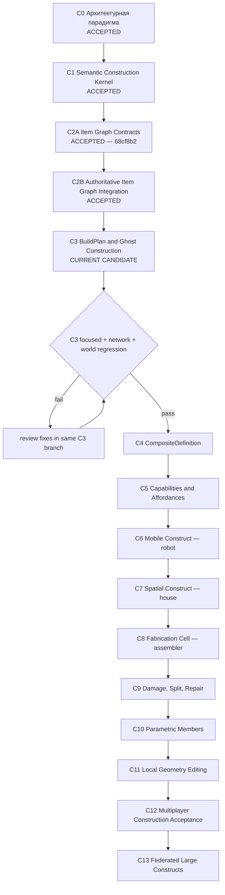

# Наглядная карта строительной линии PlanetSimulator

**Статус документа:** каноническая карта строительного трека
**База проекта:** `main @ 2879fdb7134032f645ffc5c98c0535aecfc09caf`
**C1:** `c2b9404`, ACCEPTED
**C2A:** `68cf8b2`, ACCEPTED
**C2B:** ACCEPTED после полного локального regression; commit ещё не зафиксирован
**Рабочая ветка C3:** `feature/c3-build-plan-and-ghost` поверх `feature/c2b-authoritative-item-graph-integration`
**Текущая позиция:** `C3 — BuildPlan and Ghost Construction, IMPLEMENTED CANDIDATE`

## Парадигма всей линии

PlanetSimulator создаёт не очередной редактор блоков, а **конструктор нового уровня**:

> семантический масштаб + составные предметы + компиляция facets + capability-based поведение.

Это попытка сделать стройку нового уровня и превратить её в парадигму всей линии симуляции. Игрок действует намерениями и стадиями, а система сохраняет реальный состав, identity деталей, материалы, связи, сетевую authority и возможность раскрыть объект до инженерного уровня.

## Карта движения



```text
C0 accepted: paradigm
  ↓
C1 accepted: semantic construct kernel
  ↓
C2A accepted: transaction contracts
  ↓
C2B accepted: production Item Graph + M0 authority
  ↓
C3 current: immutable BuildPlan + weightless ghost + resumable stages
  ↓ acceptance gate
C4 reusable composites → C5 affordances
  ↓
C6 robot → C7 house → C8 assembler
  ↓
C9 damage → C10 parametric construction → C11 local geometry
  ↓
C12 multiplayer construction → C13 federated constructs
```

## Статусы

| Этап | Результат | Контрольный объект | Статус |
|---|---|---|---|
| C0 | парадигма, границы доменов, roadmap | вся линия | **ACCEPTED** |
| C1 | parts, bonds, snapshots, revisions, facet compiler | стол | **ACCEPTED** |
| C2A | item projections, mutations, atomic plans | стол | **ACCEPTED — 68cf8b2** |
| C2B | production registries, shared ledger, M0 authority и recovery | стол | **ACCEPTED** |
| C3 | immutable BuildPlan, ghost projection, stages, requirements, resume и builder executor | стадийный стол | **CURRENT CANDIDATE** |
| C4 | пользовательские composite definitions and instances | повторяемый стол | PLANNED |
| C5 | capabilities and affordances | агент использует неизвестный стол | PLANNED |
| C6 | rigid islands, joints, power/control | наземный робот | PLANNED |
| C7 | sections, spaces, enclosure, utilities | дом | PLANNED |
| C8 | fabrication through the same BuildPlan | сборщик | PLANNED |
| C9 | damage, split, repair, salvage | стол/робот/секция | PLANNED |
| C10 | beams, panels, pipes, cables, profiles | строение/корабль | PLANNED |
| C11 | local CSG/SDF/microgeometry | панель/корпус | PLANNED |
| C12 | contention, permissions, reconnect, convergence | два клиента | PLANNED |
| C13 | section aggregates and cross-server authority | дом/станция/город | PLANNED |

## C2A — Item Graph Contracts

Статус: **ACCEPTED**. Этап зафиксировал строгие планы сборки и разборки, item-backed identity, транзакционные preconditions и тестовый adapter без изменения production Item Graph.

## C2B — Authoritative Item Graph Integration

Статус: **ACCEPTED**. Этап подключил реальные `ItemRegistry`/`ContainerRegistry`, общий `OperationLedger` и M0-first authoritative commit/recovery. C3 выполняет расход и перемещение предметов только через эту границу.

## C3: что появилось

```text
immutable BuildPlan
├── target ConstructSnapshot
├── exact source Item projections
├── ordered BuildStages
├── material allocations
├── required tool capabilities
└── ghost world relation
        ↓
weightless GhostState
        ↓ execute stage
C2A ConstructionItemTransactionPlan
        ↓
C2B authoritative Item Graph + shared ledger + M0
        ↓
partial ConstructSnapshot
        ↓ next stage / crash recovery / exact replay
        ↓
OPERATIONAL ConstructSnapshot
```

### Ключевой принцип ghost

Ghost до первой стадии:

- не является `ItemInstance`;
- не имеет массы;
- не имеет collision/physics authority;
- не имеет capabilities;
- не создаёт construct root;
- является только persisted intention/projection BuildPlan.

После первой стадии физическим становится **частично построенный construct**, а не ghost. Ghost продолжает показывать план и прогресс, но не дублирует массу и поведение объекта.

### Стадии контрольного стола

```text
0 FOUNDATION
  top + two supports + 2 fasteners
  ConstructSnapshot = PARTIAL
  capabilities = []

1 FRAME
  remaining two supports + 2 fasteners
  ConstructSnapshot = PARTIAL
  capabilities = []

2 COMMISSIONING
  sealant + inspection capability
  ConstructSnapshot = OPERATIONAL
  capabilities = PLACE_ITEMS / SUPPORT_SURFACE / WORK_SURFACE
```

### Recovery C3

```text
stage transaction committed in C2B
→ process crashes before GhostState update
→ ConstructSnapshot and shared ledger remain authoritative
→ C3 reconcile identifies matching deterministic stage snapshot
→ ghost progress advances without repeating material consumption
→ repeated operation ID returns exact replay
```

BuildPlan хранит исходные item projections и точные allocations. Поэтому transaction plan каждой стадии детерминирован и может быть восстановлен после перезапуска с тем же checksum.

## Сквозные архитектурные линии

```text
Item identity       C1 ─ C2A ─ C2B ─ C3 ─────────────────────────► C13
Authority/replay    C1 ─ C2A ─ C2B ─ C3 ─────────────────────────► C13
Build intent        C0 ────────────── C3 ─ C4 ─ C8 ──────────────► C13
Facet compilation   C1 ───────── C3 ─ C5 ─ C6 ─ C7 ─ C9 ─ C11 ─► C13
Capabilities        C1 ───────── C3 ─ C5 ─ C6 ─ C7 ─ C8 ────────► C13
Semantic scale      C0 ───────────────── C7 ─ C10 ─ C11 ─────────► C13
Spatial partition   C0 ───────────────── C7 ───────── C12 ─ C13
```

Новый этап не принимается, если он:

1. создаёт вторую identity предмета;
2. меняет Item Graph вне C2B authority boundary;
3. делает ghost физическим источником истины;
4. выдаёт capabilities частичной конструкции как operational;
5. повторно расходует материал после replay/recovery;
6. делает progress state сильнее authoritative construct/ledger;
7. превращает mesh или Node3D в каноническое состояние.

## Контрольные вертикальные объекты

- **Стол:** identity, parts, bonds, materials, stages, rollback, capabilities.
- **Робот:** rigid islands, joints, power, control, sensors, container, partial failure.
- **Дом:** sections, rooms, enclosure, utilities, semantic activation.
- **Сборщик:** input/output, tooling и исполнение того же BuildPlan.
- **Корабельная секция:** pressure topology, damage, leaks, split and authority transfer.

## Правило фиксации движения

Каждое продвижение обновляет одновременно:

1. `CONSTRUCTION_MAP_RU.md`;
2. `CONSTRUCTION_ROADMAP_RU.md`;
3. `CONSTRUCTION_PROGRESS_LOG_RU.md`;
4. checkpoint этапа;
5. delivery manifest;
6. validation JSON;
7. focused runner;
8. обязательный world-regression manifest.

Статус `ACCEPTED` назначается только после внешней проверки focused, network и полного world regression.
