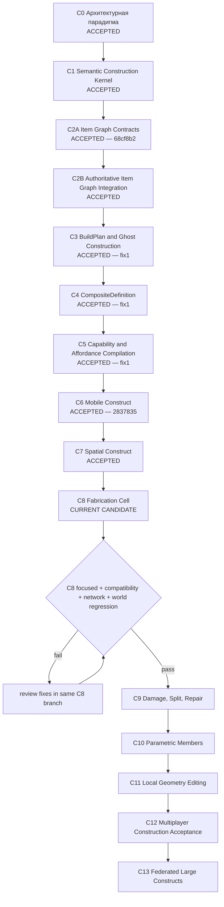

# Наглядная карта строительной линии PlanetSimulator

**Статус документа:** каноническая карта строительного трека
**База проекта:** `main @ 2879fdb7134032f645ffc5c98c0535aecfc09caf`
**C1:** `c2b9404`, ACCEPTED
**C2A:** `68cf8b2`, ACCEPTED
**C2B:** `d5c9187`, ACCEPTED
**C3:** ACCEPTED вместе с fix1; reviewed delivery SHA-256 `2296f48f0f31c8d4feb9290e0973d27dd4b4f85ed9c7f29361f28156b82ac256`
**C4:** ACCEPTED вместе с fix1
**C5:** ACCEPTED вместе с fix1; база C4 `b985cde`
**C6:** `2837835`, ACCEPTED
**C7:** ACCEPTED; reviewed delivery SHA-256 `5a4cebb21587ed8c4b54852145b6a018445438866bc1908d5cf9bcc4fe9aee87`
**Рабочая ветка C8:** `feature/c8-fabrication-cell` поверх принятого C7
**Текущая позиция:** `C8 — Fabrication Cell, IMPLEMENTED CANDIDATE`

## Парадигма всей линии

PlanetSimulator создаёт не очередной редактор блоков, а **конструктор нового уровня**:

> семантический масштаб + составные предметы + компиляция facets + capability-based поведение.

Это попытка сделать стройку нового уровня и превратить её в парадигму всей линии симуляции. Игрок действует намерениями и стадиями, а система сохраняет реальный состав, identity деталей, материалы, связи, сетевую authority и возможность раскрыть объект до инженерного уровня.

## Карта движения



```text
C0 accepted: paradigm
  ↓
C1 accepted: semantic construct kernel
  ↓
C2A accepted: transaction contracts
  ↓
C2B accepted: production Item Graph + M0 authority
  ↓
C3 accepted: immutable BuildPlan + weightless ghost + resumable stages
  ↓
C4 accepted: reusable semantic definitions + deterministic late binding
  ↓
C5 accepted: typed behavior profiles + part/port affordances + semantic queries
  ↓
C6 accepted: mobile subsystem graph + dynamic degradation + checksum-pinned commands
  ↓
C7 accepted: sections + Space Graph + enclosure + utilities + activation
  ↓
C8 current: recipes + machine capabilities + queue + authoritative material flow
  ↓ acceptance gate
C9 damage → C10 parametric construction → C11 local geometry
  ↓
C12 multiplayer construction → C13 federated constructs
```

## Статусы

| Этап | Результат | Контрольный объект | Статус |
|---|---|---|---|
| C0 | парадигма, границы доменов, roadmap | вся линия | **ACCEPTED** |
| C1 | parts, bonds, snapshots, revisions, facet compiler | стол | **ACCEPTED** |
| C2A | item projections, mutations, atomic plans | стол | **ACCEPTED — 68cf8b2** |
| C2B | production registries, shared ledger, M0 authority и recovery | стол | **ACCEPTED** |
| C3 | immutable BuildPlan, ghost projection, stages, requirements, resume и builder executor | стадийный стол | **ACCEPTED — fix1** |
| C4 | semantic slots, typed parameters, exposed ports, reusable definitions и deterministic BuildPlan compilation | два параметризованных экземпляра стола | **ACCEPTED — fix1** |
| C5 | typed capabilities, concrete affordances, semantic query и rebuildable profiles | агент использует неизвестный стол | **ACCEPTED — fix1** |
| C6 | power/control/drive/sensor subsystems, quorum, dependency cascade и mobile commands | наземный робот | **ACCEPTED** |
| C7 | sections, spaces, enclosure, openings, utilities и activation LOD | дом | **ACCEPTED** |
| C8 | recipes, machine profiles, work queue, atomic material reservation/consumption и fabricated outputs | производственная ячейка | **CURRENT CANDIDATE** |
| C9 | damage, split, repair, salvage | стол/робот/секция | PLANNED |
| C10 | beams, panels, pipes, cables, profiles | строение/корабль | PLANNED |
| C11 | local CSG/SDF/microgeometry | панель/корпус | PLANNED |
| C12 | contention, permissions, reconnect, convergence | два клиента | PLANNED |
| C13 | section aggregates and cross-server authority | дом/станция/город | PLANNED |

## C2A — Item Graph Contracts

Статус: **ACCEPTED**. Этап зафиксировал строгие планы сборки и разборки, item-backed identity, транзакционные preconditions и тестовый adapter без изменения production Item Graph.

## C2B — Authoritative Item Graph Integration

Статус: **ACCEPTED**. Этап подключил реальные `ItemRegistry`/`ContainerRegistry`, общий `OperationLedger` и M0-first authoritative commit/recovery. C3 выполняет расход и перемещение предметов только через эту границу.

## C3 — BuildPlan and Ghost Construction

Статус: **ACCEPTED вместе с fix1**. Этап зафиксировал resumable execution plan, невесомый ghost, staged partial constructs и recovery после authoritative commit.

## C3: что появилось

```text
immutable BuildPlan
├── target ConstructSnapshot
├── exact source Item projections
├── ordered BuildStages
├── material allocations
├── required tool capabilities
└── ghost world relation
        ↓
weightless GhostState
        ↓ execute stage
C2A ConstructionItemTransactionPlan
        ↓
C2B authoritative Item Graph + shared ledger + M0
        ↓
partial ConstructSnapshot
        ↓ next stage / crash recovery / exact replay
        ↓
OPERATIONAL ConstructSnapshot
```

### Ключевой принцип ghost

Ghost до первой стадии:

- не является `ItemInstance`;
- не имеет массы;
- не имеет collision/physics authority;
- не имеет capabilities;
- не создаёт construct root;
- является только persisted intention/projection BuildPlan.

После первой стадии физическим становится **частично построенный construct**, а не ghost. Ghost продолжает показывать план и прогресс, но не дублирует массу и поведение объекта.

### Стадии контрольного стола

```text
0 FOUNDATION
  top + two supports + 2 fasteners
  ConstructSnapshot = PARTIAL
  capabilities = []

1 FRAME
  remaining two supports + 2 fasteners
  ConstructSnapshot = PARTIAL
  capabilities = []

2 COMMISSIONING
  sealant + inspection capability
  ConstructSnapshot = OPERATIONAL
  capabilities = PLACE_ITEMS / SUPPORT_SURFACE / WORK_SURFACE
```

### Recovery C3

```text
stage transaction committed in C2B
→ process crashes before GhostState update
→ ConstructSnapshot and shared ledger remain authoritative
→ C3 reconcile identifies matching deterministic stage snapshot
→ ghost progress advances without repeating material consumption
→ repeated operation ID returns exact replay
```

BuildPlan хранит исходные item projections и точные allocations. Поэтому transaction plan каждой стадии детерминирован и может быть восстановлен после перезапуска с тем же checksum.


## C4: CompositeDefinition

**Статус:** ACCEPTED вместе с fix1.

```text
completed operational construct + accepted C3 BuildPlan
        ↓ promotion
CompositeDefinition v1
├── semantic part slots (no item IDs)
├── bond templates (slot-to-slot topology)
├── stage templates
├── material requirements by definition
├── typed parameter definitions
├── exposed ports bound to semantic slots
├── version + checksum + provenance
└── no concrete construct/build-plan/container identity
        ↓ deterministic late binding
available Item projections
        ↓
concrete C3 BuildPlan + CompositeInstantiation record
        ↓
unchanged C3 → C2A → C2B execution path
```

Ключевой результат: один пользовательский тип создаёт несколько независимых constructs с разными реальными предметами. `CompositeDefinition` не является prefab: каноническими остаются реальные parts, bonds и Item Graph identity каждого экземпляра.

C4 v1 использует точное `definition_id` и optional component subset для part slots. Typed parameters имеют строгий тип/default и pin-ятся в каждом instantiation. Exposed ports компилируются semantic slot → concrete part ID и публикуются по мере установки частей. Материалы выбираются детерминированно по item ID, могут распределяться между несколькими stacks и не исчерпывают stack из-за текущего C2A/C3 ограничения. Concrete binding сохраняется отдельным checksum-защищённым `CompositeInstantiation`, поэтому версия определения и происхождение каждого BuildPlan остаются проверяемыми.

Partial и final snapshots несут pinned provenance:

```text
composite_definition_id
composite_definition_version
composite_definition_checksum
composite_instantiation_id
composite_parameters
composite_exposed_ports
```


## C5: Capability and Affordance Compilation

**Статус:** ACCEPTED вместе с fix1.

```text
Authoritative ConstructSnapshot
        ↓ deterministic behavior compiler
ConstructionBehaviorProfile
├── typed capabilities
├── concrete provider parts
├── concrete exposed ports
└── action affordances + actor requirements
        ↓ semantic query
unknown-object agent action selection
```

Ключевые правила:

- profile является rebuildable projection, а не новым authoritative aggregate;
- partial и damaged constructs не публикуют operational actions;
- affordance обязан ссылаться на provider part/port собственного capability;
- C4 parameter values становятся queryable properties;
- resolver не использует prefab/display name;
- равные запросы детерминированно сортируют кандидатов;
- stale и same-revision profile mutation отклоняются.

Контрольный объект: два неизвестных параметризованных стола. Generic agent выбирает `PLACE_ITEM` по `load_rating_kg`, `finish` и своим actor capabilities, затем теряет действие после structural damage.

## Сквозные архитектурные линии

```text
Item identity       C1 ─ C2A ─ C2B ─ C3 ─ C4 ────────────────────► C13
Authority/replay    C1 ─ C2A ─ C2B ─ C3 ─ C4 ────────────────────► C13
Build intent        C0 ────────────── C3 ─ C4 ─ C8 ──────────────► C13
Reusable types      C0 ───────────────── C4 ─ C5 ─ C8 ───────────► C13
Facet compilation   C1 ───────── C3 ─ C5 ─ C6 ─ C7 ─ C9 ─ C11 ─► C13
Capabilities        C1 ───────── C3 ─ C5 ─ C6 ─ C7 ─ C8 ────────► C13
Semantic scale      C0 ───────────────── C7 ─ C10 ─ C11 ─────────► C13
Spatial partition   C0 ───────────────── C7 ───────── C12 ─ C13
```

Новый этап не принимается, если он:

1. создаёт вторую identity предмета;
2. меняет Item Graph вне C2B authority boundary;
3. делает ghost физическим источником истины;
4. выдаёт capabilities частичной конструкции как operational;
5. повторно расходует материал после replay/recovery;
6. делает progress state сильнее authoritative construct/ledger;
7. превращает mesh или Node3D в каноническое состояние;
8. сохраняет конкретные item/construct/build-plan IDs внутри reusable definition;
9. связывает CompositeDefinition с отдельным execution path в обход C3/C2B.

## Контрольные вертикальные объекты

- **Стол:** identity, parts, bonds, materials, stages, rollback, capabilities.
- **Робот:** rigid islands, joints, power, control, sensors, container, partial failure.
- **Дом:** sections, rooms, enclosure, utilities, semantic activation.
- **Сборщик:** input/output, tooling и исполнение того же BuildPlan.
- **Корабельная секция:** pressure topology, damage, leaks, split and authority transfer.

## Правило фиксации движения

Каждое продвижение обновляет одновременно:

1. `CONSTRUCTION_MAP_RU.md`;
2. `CONSTRUCTION_ROADMAP_RU.md`;
3. `CONSTRUCTION_PROGRESS_LOG_RU.md`;
4. checkpoint этапа;
5. delivery manifest;
6. validation JSON;
7. focused runner;
8. обязательный world-regression manifest.

Статус `ACCEPTED` назначается только после внешней проверки focused, network и полного world regression.


## C6: Mobile Construct

**Статус:** ACCEPTED.

```text
Authoritative ConstructSnapshot
├── concrete mobile parts
├── bond states
└── compiled_facets.mobile_subsystems
        ↓ deterministic subsystem compiler
ConstructionMobileProfile
├── POWER / CONTROL / DRIVE / SENSOR states
├── provider quorum
├── dependency cascade
├── MOBILE / DEGRADED / IMMOBILE
├── C5 capability descriptors
└── concrete mobile affordances
        ↓ checksum-pinned command
ConstructionMobileCommandAuthorizer
```

Ключевые правила C6:

- profile остаётся rebuildable projection authoritative `ConstructSnapshot`;
- health subsystem вычисляется из состояния конкретных parts, обязательных bonds и dependency graph;
- quorum позволяет потерять часть однотипных providers без полного отказа;
- `DAMAGED` больше не означает автоматический ноль всех возможностей: сохраняются только реально работоспособные подсистемы;
- потеря sensor не лишает робота движения;
- потеря power/control каскадно отключает drive и sensor;
- команда pin-ит checksum профиля и не исполняется против устаревшей конфигурации;
- физическое движение, network endpoint и graphical control остаются за следующим runtime-интеграционным слоем.

Контрольный объект: восьмикомпонентный колёсный rover. Потеря одного колеса снижает максимальную скорость `8 → 6 м/с`, потеря трёх колёс опускает drive ниже quorum и делает rover `IMMOBILE`, sensor failure сохраняет движение, battery/controller failure каскадно отключает зависимые подсистемы, а ремонт возвращает полный профиль.


## C7: Spatial Construct

**Статус:** ACCEPTED.

```text
Authoritative ConstructSnapshot
├── structural sections
├── exterior/interior openings
├── closure parts and bond states
├── semantic spaces
└── utility dependency graph
        ↓ deterministic spatial compiler
ConstructionSpatialProfile
├── section states
├── opening states
├── HABITABLE / DEGRADED / EXPOSED / INACTIVE spaces
├── POWER / DATA / WATER / AIR / HEAT utilities
├── ACTIVE / DEGRADED / INACTIVE building state
├── DORMANT / SUMMARY / FUNCTIONAL activation level
├── C5 capabilities
└── concrete spatial affordances
        ↓ checksum-pinned command
ConstructionSpatialCommandAuthorizer
```

Ключевые правила C7:

- Space Graph является семантическим DTO и не выводится из mesh/Node3D;
- enclosure зависит от section quorum, bonds и состояния exterior openings;
- открытая исправная дверь деградирует герметичность, но не уничтожает помещение;
- разрушенная стена, окно или door bond переводят room в `EXPOSED`;
- utility failure деградирует функциональность независимо от enclosure;
- зависимость DATA → POWER отключает data при потере power;
- partial construct остаётся `DORMANT` и не публикует spatial behavior;
- profile является rebuildable projection и pin-ит authoritative construct checksum.

Контрольный объект: однокомнатный дом с шестью boundary sections, дверью, окном, power panel и data router.


## C8: Fabrication Cell

**Статус:** ACCEPTED.

```text
Versioned FabricationRecipe
        ↓ deterministic allocation
FabricationJob + exact item bindings
        ↓ reserve
C2A FABRICATION_RESERVE plan
        ↓ C2B authority
inputs in machine input container
machine ConstructSnapshot pins active job
        ↓ idempotent work progress
C2A FABRICATION_COMPLETE plan
├── consume exact/partial input stacks
├── create fabricated ItemInstance outputs
└── update machine ConstructSnapshot
        ↓
normal Item Graph + output container + C3 BuildPlan
```

Ключевые правила C8:

- recipe version неизменяема и закрепляется checksum в каждом job;
- очередь не хранит альтернативные предметы: input/output bindings ссылаются на реальные item identities;
- reservation, completion и release проходят через расширенный C2A plan и общий C2B authoritative adapter;
- machine availability выводится из concrete parts/bonds, C5 behavior capabilities и C7 utilities;
- progress operation идемпотентна по operation ID;
- crash после authoritative completion восстанавливается по `fabrication_runtime.last_completed_job_id`;
- exact replay не расходует материал повторно и не создаёт второй продукт;
- fabricated item содержит `fabrication_origin` и возвращается в обычный Item Graph;
- изготовленная балка используется как source projection обычного C3 BuildPlan;
- анимация станка, tick-based power/heat/tool wear и UI остаются вне C8.

Контрольный объект: CNC-cell, которая при наличии WORKSTATION capability и POWER utility резервирует coolant и steel, выполняет десять work units и выпускает structural beam.


## C9: Damage, Split, Repair

**Статус:** IMPLEMENTED CANDIDATE.

```text
DamageRequest + source checksum
        ↓ deterministic topology update
connected components
├── retained source aggregate
├── split child aggregate(s)
└── salvage ItemInstance(s)
        ↓ one authoritative transaction
Item Graph + multiple ConstructSnapshots + shared ledger
        ↓ pinned RepairPlan
inverse transaction restores original topology
```

Ключевые правила C9:

- broken bonds и destroyed parts исключаются из connectivity graph;
- retained component выбирается explicit `retained_part_id`;
- split identity задаётся до commit, а не генерируется внутри adapter;
- parts никогда не копируются между outcomes;
- source update, child create/delete и item relation changes атомарны;
- salvage policy задаёт минимальный размер нового construct и конечную relation;
- repair ghost проверяет наличие реальных item identities;
- exact damage/repair replay не меняет generation;
- terminal operation conflict отклоняет другой payload с тем же ID;
- C5–C8 profiles после damage/repair должны перестраиваться из новых snapshots.

Контрольный объект: bridge-arm из шести parts, который после двух broken bonds разделяется на source, двухкомпонентный child construct и одиночный salvage sensor, а затем полностью собирается обратно.
