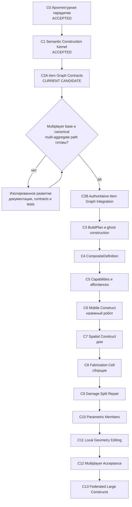

# Наглядная карта строительной линии PlanetSimulator

**Статус документа:** каноническая навигационная карта строительного трека
**База линии:** `main @ 2879fdb7134032f645ffc5c98c0535aecfc09caf`
**Рабочая ветка:** `feature/c1-semantic-construction-kernel`
**Текущая позиция:** `C2A — Item Graph Contracts`
**Последнее принятое основание:** `C1 fix1 — ACCEPTED`

## 1. Главная линия

PlanetSimulator развивает не отдельный редактор блоков, а **конструктор нового уровня**:

> семантический масштаб + составные предметы + компиляция facets + capability-based поведение.

Эта формула является парадигмой всей строительной линии. Каждый этап обязан сохранять предметную идентичность, авторитетную сетевую границу, локальную активацию сложности и возможность перехода от простого пользовательского действия к глубокой инженерной симуляции.

## 2. Карта движения



Текстовый вариант:

```text
C0 принят
  ↓
C1 принят
  ↓
C2A текущий изолированный этап
  ↓
GATE: завершена базовая multiplayer-линия
  ↓
C2B реальная интеграция Item Graph
  ↓
C3 → C4 → C5
  ↓
стол → робот → дом → сборщик → корабельная секция
  ↓
C9 → C10 → C11
  ↓
C12 → C13
```

## 3. Статусы этапов

| Этап | Основной результат | Контрольный объект | Gate | Статус |
|---|---|---|---|---|
| C0 | парадигма, границы доменов, roadmap | вся линия | нет | **ACCEPTED** |
| C1 | parts, bonds, snapshot, revision/replay, capability compiler | стол | обязательный regression | **ACCEPTED** |
| C2A | проекции Item Graph, item/construct mutations, атомарный план, sandbox adapter | сборка и разборка стола | без runtime-интеграции | **CURRENT CANDIDATE** |
| C2B | реальные контейнеры, Item Graph, M0 transaction coordinator, общий ledger | тот же стол | multiplayer base | **BLOCKED BY GATE** |
| C3 | ghost construct, материалы, стадии, resumable jobs | каркас стола/комнаты | C2B | PLANNED |
| C4 | пользовательские composite definitions и instances | повторно размещаемый стол | C3 | PLANNED |
| C5 | capabilities и affordances как общий слой поведения | агент использует стол | C4 | PLANNED |
| C6 | rigid islands, joints, power/control graphs | наземный робот | C5 | PLANNED |
| C7 | sections, spaces, enclosure, инженерные сети | дом | C6 | PLANNED |
| C8 | производство через тот же BuildPlan | сборщик | C3–C7 | PLANNED |
| C9 | повреждение, split, repair и salvage | стол/робот/секция | C6–C8 | PLANNED |
| C10 | балки, панели, трубы, кабели, профили | строение/корабль | C9 | PLANNED |
| C11 | локальные CSG/SDF/voxel regions | корпус/панель | C10 | PLANNED |
| C12 | contention, reconnect, replay, permissions, convergence | два клиента | multiplayer stable | PLANNED |
| C13 | section aggregates и межсерверная authority | дом/станция/город | distributed runtime | PLANNED |

## 4. Архитектурные линии, проходящие через все этапы

```text
Item identity       C1 ───────────────────────────────────────────────► C13
Authority/replay    C1 ─ C2A ─ C2B ─────────────────────────────────► C13
Facet compilation   C1 ───────── C5 ─ C6 ─ C7 ─ C9 ─ C11 ─────────► C13
Capabilities        C1 ───────── C5 ─ C6 ─ C7 ─ C8 ────────────────► C13
Semantic scale      C0 ───────────────── C7 ─ C10 ─ C11 ───────────► C13
Spatial partition   C0 ───────────────── C7 ───────── C12 ─ C13
```

Новый функционал не принимается, если он разрывает хотя бы одну из линий:

- создаёт вторую идентичность предмета;
- меняет предметы вне авторитетной транзакции;
- делает меш или Node3D источником истины;
- требует постоянно симулировать всю сохранённую детализацию;
- привязывает поведение только к prefab-классу;
- не имеет детерминированного snapshot/replay-контракта.

## 5. C2A — Item Graph Contracts

C2A отвечает на вопрос:

> Как выразить сборку из реальных предметов так, чтобы позднее без перепроектирования подключить её к canonical Item Graph и M0 multi-aggregate transactions?

Текущая модель:

```text
предмет в CONTAINER/WORLD
        ↓ transaction plan
item projection + exact before state
        ↓
ATTACHMENT relation
assembly_id  = construct_id
parent_item  = construct root item
socket_id    = part_id
        ↓
ConstructSnapshot объявляет ту же part binding
```

Резервирование материалов пока не записывается как новый вид relation. Оно существует только внутри авторитетного плана до commit. Это предотвращает появление промежуточной параллельной модели Item Graph.

C2A создаёт:

- совместимую проекцию `item_instance.v2`;
- строгие item mutations `CREATE/UPDATE/DELETE`;
- строгую construct mutation;
- checksum-protected transaction plan;
- обязательные инварианты идентичности, root и part bindings;
- in-memory adapter с exact replay и retryable failure;
- сборку стола с расходом крепежа;
- разборку с возвратом деталей и без автоматического возврата расходников.

C2A намеренно **не** создаёт:

- новый runtime service;
- новый persistent Item Graph;
- новый transport path;
- интеграцию с UI/инвентарём;
- реальный M0 coordinator batch;
- сетевую репликацию construction-команд.

## 6. C2B — Authoritative Item Graph Integration

C2B разрешается только после выполнения gate:

1. canonical multiplayer command path стабилен;
2. M0 aggregate transaction coordinator принят как общий механизм;
3. Item Graph operations поддерживают необходимые multi-aggregate preconditions;
4. reconnect/replay не допускает повторного расхода материалов;
5. persistence имеет единый recovery boundary для items, constructs и ledger.

В C2B проекция C2A должна стать адаптером к реальному `item_instance.v2`, а C2A plan — детерминированным builder для `MutationBatch`. Sandbox adapter после этого останется contract-test fixture, но не runtime-хранилищем.

## 7. Контрольные вертикальные прототипы

### Стол

Проверяет item identity, bonds, surface capabilities, расход материалов, сборку, разборку и rollback.

### Наземный робот

Проверяет несколько rigid islands, joints, power/control graphs, контейнер и частичные отказы.

### Дом

Проверяет static sections, Space Graph, комнаты, двери, enclosure и активацию семантической детализации.

### Сборщик

Проверяет, что производство и ручная стройка создают один и тот же ConstructAggregate через один BuildPlan.

### Корабельная секция

Проверяет pressure topology, повреждения, утечки, split, новый aggregate ID и сетевую передачу authority.

## 8. Правило фиксации движения

Каждое продвижение по карте обязано обновлять одновременно:

1. этот документ;
2. `CONSTRUCTION_ROADMAP_RU.md`;
3. `CONSTRUCTION_PROGRESS_LOG_RU.md`;
4. checkpoint текущего этапа;
5. delivery manifest;
6. validation JSON;
7. focused runner;
8. обязательный world-regression manifest.

Этап получает статус `ACCEPTED` только после внешней проверки полного обязательного регресса.
