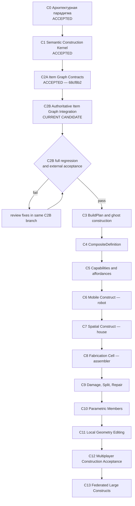

# Наглядная карта строительной линии PlanetSimulator

**Статус документа:** каноническая карта и журнал положения строительного трека
**База проекта:** `main @ 2879fdb7134032f645ffc5c98c0535aecfc09caf`
**Принятый C1:** `c2b9404`
**Принятый C2A:** `68cf8b2`
**Рабочая ветка C2B:** `feature/c2b-authoritative-item-graph-integration`
**Текущая позиция:** `C2B — Authoritative Item Graph Integration, IMPLEMENTED CANDIDATE`

## Парадигма всей линии

PlanetSimulator создаёт не очередной редактор блоков, а **конструктор нового уровня**:

> семантический масштаб + составные предметы + компиляция facets + capability-based поведение.

Стройка должна оставаться простой на уровне намерения игрока и глубокой внутри симуляции. Один объект может быть готовым предметом, раскрываемым composite, системой деталей, инженерных сетей и пространств. Полная сложность хранится, но активируется локально и по необходимости.

## Карта движения



```text
C0 accepted
  ↓
C1 accepted: semantic construct kernel
  ↓
C2A accepted: isolated Item Graph contracts
  ↓
C2B current: production registries + common ledger + M0 atomic authority
  ↓ acceptance gate
C3 BuildPlan → C4 composites → C5 capabilities
  ↓
C6 robot → C7 house → C8 assembler
  ↓
C9 damage → C10 parametric construction → C11 local geometry
  ↓
C12 multiplayer construction → C13 federated constructs
```

## Статусы

| Этап | Результат | Контрольный объект | Статус |
|---|---|---|---|
| C0 | парадигма, границы доменов, roadmap | вся линия | **ACCEPTED** |
| C1 | parts, bonds, snapshots, revisions, capability compiler | стол | **ACCEPTED** |
| C2A | item projections, mutation plan, sandbox adapter | стол | **ACCEPTED — 68cf8b2** |
| C2B | production Item/Container registries, shared ledger, M0 authority, recovery | стол | **CURRENT CANDIDATE** |
| C3 | ghost construct, stages, material reservation and jobs | стол/комната | PLANNED |
| C4 | пользовательские composite definitions and instances | повторяемый стол | PLANNED |
| C5 | capabilities and affordances | агент использует неизвестный стол | PLANNED |
| C6 | rigid islands, joints, power/control | наземный робот | PLANNED |
| C7 | sections, spaces, enclosure, utilities | дом | PLANNED |
| C8 | fabrication through the same BuildPlan | сборщик | PLANNED |
| C9 | damage, split, repair, salvage | стол/робот/секция | PLANNED |
| C10 | beams, panels, pipes, cables, profiles | строение/корабль | PLANNED |
| C11 | local CSG/SDF/microgeometry | панель/корпус | PLANNED |
| C12 | contention, permissions, reconnect, convergence | два клиента | PLANNED |
| C13 | section aggregates and cross-server authority | дом/станция/город | PLANNED |

## Что именно закрывает C2B

```text
C2A ConstructionItemTransactionPlan
        ↓ deterministic translation
M0 MutationBatch
        ├── aggregate/construction/item-graph
        ├── aggregate/construction/operation-ledger
        └── aggregate/construction/construct:...
        ↓ prepare + atomic commit
production ItemRegistry + ContainerRegistry
shared ItemOperationLedger + ConstructStore
```

C2B вводит следующие обязательные свойства:

1. Реальные `ItemRegistry`, `ContainerRegistry`, `ItemRelationshipValidator` и `ItemMassService` участвуют в проверке кандидата.
2. Установленные детали используют каноническую `ATTACHMENT` relation.
3. M0 commit выполняется до локальной materialization и становится авторитетной точкой восстановления.
4. Exact replay не расходует материал повторно.
5. Terminal rejection хранится в общем Item Operation Ledger.
6. Retryable failure не отравляет operation ID.
7. При аварии после M0 commit новый runtime восстанавливает Item Graph, ledger и constructs из M0 repository.
8. Ревизия `ConstructSnapshot` отделена от ревизии M0 aggregate envelope.
9. Persistence bundle защищён checksum и не может перезаписать отличающееся M0-состояние.

C2B пока не подключает строительные команды к игровому UI, клиентскому transport или сцене. Это будет отдельный последующий вертикальный этап после приёмки доменного integration boundary.

## Сквозные архитектурные линии

```text
Item identity       C1 ─ C2A ─ C2B ───────────────────────────────► C13
Authority/replay    C1 ─ C2A ─ C2B ───────────────────────────────► C13
Facet compilation   C1 ───────── C5 ─ C6 ─ C7 ─ C9 ─ C11 ───────► C13
Capabilities        C1 ───────── C5 ─ C6 ─ C7 ─ C8 ──────────────► C13
Semantic scale      C0 ───────────────── C7 ─ C10 ─ C11 ─────────► C13
Spatial partition   C0 ───────────────── C7 ───────── C12 ─ C13
```

Новый этап не принимается, если он создаёт вторую identity предмета, меняет Item Graph вне authority boundary, делает Node3D/mesh источником истины, смешивает все инженерные графы или требует постоянно симулировать всю сохранённую сложность.

## Контрольные вертикальные объекты

- **Стол:** identity, parts, bonds, material consumption, rollback, capabilities.
- **Робот:** rigid islands, joints, power, control, sensors, container, partial failure.
- **Дом:** sections, rooms, enclosure, utilities, semantic activation.
- **Сборщик:** input/output, tooling, BuildPlan execution, production parity.
- **Корабельная секция:** pressure topology, damage, leaks, split and authority transfer.

## Правило фиксации движения

Каждое продвижение обновляет одновременно:

1. `CONSTRUCTION_MAP_RU.md`;
2. `CONSTRUCTION_ROADMAP_RU.md`;
3. `CONSTRUCTION_PROGRESS_LOG_RU.md`;
4. checkpoint этапа;
5. delivery manifest;
6. validation JSON;
7. focused runner;
8. обязательный world-regression manifest.

Статус `ACCEPTED` назначается только после внешней проверки focused, network и полного world regression.

## C2A — Item Graph Contracts

Принятый изолированный слой контрактов и транзакционных планов, commit `68cf8b2`.

## C2B — Authoritative Item Graph Integration

Текущий реализованный кандидат, подключающий C2A к production Item Graph и M0 authority boundary.
